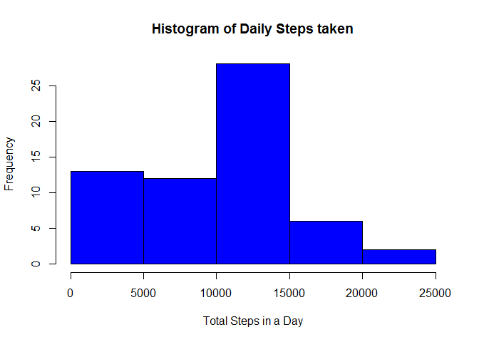
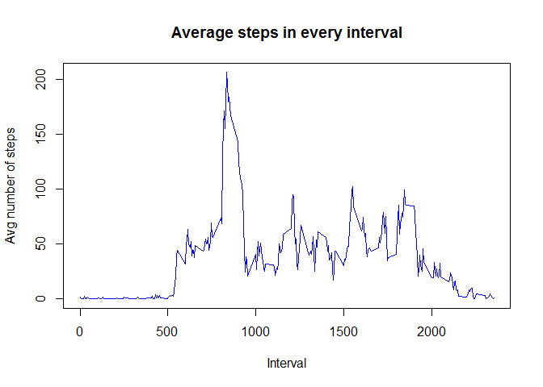
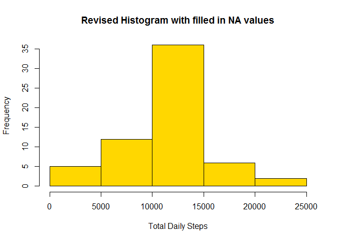
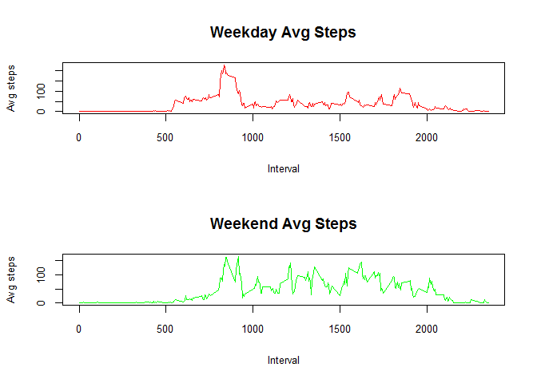

# Fitness Activity
RC  
September 7, 2016  


### Loading the Data Set - Processing as a Data Table


```r
library(data.table)
```

```
## Warning: package 'data.table' was built under R version 3.3.1
```

```r
activity<-read.csv("./activity.csv")
DT_activity<-data.table(activity)
```

The data is loaded into the system as a data table called "DT_activity"


###Histogram and other statistical data for mean steps taken per day

```r
daily_steps<-DT_activity[,.(steps.SUM=sum(steps,na.rm=TRUE)),by=date]
hist(daily_steps$steps.SUM,col="blue",main="Histogram of Daily Steps taken",xlab="Total Steps in a Day")
```

<!-- -->

```r
mean_steps<-mean(daily_steps$steps.SUM,na.rm=TRUE)
median_steps<-median(daily_steps$steps.SUM,na.rm=TRUE)
```

- *The mean number of steps taken per day is 9354*
- *The median number of steps taken per day is 10395*


###Time Series Plot for Average number of steps in each interval


```r
avg_steps<-DT_activity[,.(avgsteps=mean(steps,na.rm=TRUE)),by=interval]
plot(avg_steps$interval,avg_steps$avgsteps,col="blue",xlab="Interval",ylab="Avg number of steps",main="Average steps in every interval",type="l")
```

<!-- -->

```r
max_interval<-avg_steps$interval[avg_steps$avgsteps==max(avg_steps$avgsteps)]
max_steps<-max(avg_steps$avgsteps,na.rm=TRUE)
```

- *The interval with max steps 206 is 835*


###Imputation of Missing Values - NA

The NA values will be filled in using the median values of the corresponding 5 minute interval across other days


```r
new_activity<-DT_activity
for(i in 1:length(new_activity$steps))
  
{
  if(is.na(new_activity$steps[i]))
    (
      new_activity$steps[i]<-avg_steps$avgsteps[avg_steps$interval==new_activity$interval[i]]
    )
}

daily_steps_new<-new_activity[,.(steps.SUM=sum(steps)),by=date]
avg_steps_new<-as.integer(mean(daily_steps_new$steps.SUM))
median_steps_new<-as.integer(median(daily_steps_new$steps.SUM))

diff_avg_steps<-(avg_steps_new-mean_steps)
diff_median_steps<-(median_steps_new-median_steps)


#drawing the histogram
hist(daily_steps_new$steps.SUM,col="gold",main="Revised Histogram with filled in NA values",xlab="Total Daily Steps")
```

<!-- -->

```r
print(avg_steps_new)
```

```
## [1] 10766
```

```r
print(diff_avg_steps)
```

```
## [1] 1411.77
```

*The new mean steps/day is 10766 and new median steps/day is 10766*

*The old mean steps/day is 9354 and old median steps/day is 10395*

The values are hence impacted due to the new NA data imputation strategy

**The difference in mean steps/day is 1411 and median steps/day is 371**


###Pattern Differences in Weekend and Weekday trends


```r
new_activity$weekday<-weekdays(as.POSIXlt(new_activity$date))
new_activity$status_date<-NA

for(i in 1:length(new_activity$steps))
{
  if(new_activity$weekday[i]=="Saturday" || new_activity$weekday[i]=="Sunday")
  {
    new_activity$status_date[i]<-"weekend"
  }
 else
 {
   new_activity$status_date[i]<-"weekday"
 }
}

#convert day status into a factor
#new_activity$status_date<-as.factor(new_activity$status_date)

#separate data sets for weekend and weekday interval averages
new_activity_weekday<-subset(new_activity,new_activity$status_date=="weekday")
new_activity_weekend<-subset(new_activity,new_activity$status_date=="weekend")

avg_steps_weekend<-new_activity_weekend[,.(avgsteps=mean(steps,na.rm=TRUE)),by=interval]

avg_steps_weekday<-new_activity_weekday[,.(avgsteps=mean(steps,na.rm=TRUE)),by=interval]

#Interval with max steps in weekend and weekday data sets
max_int_weekend<-avg_steps_weekend$interval[avg_steps_weekend$avgsteps==max(avg_steps_weekend$avgsteps)]

max_int_weekday<-avg_steps_weekday$interval[avg_steps_weekday$avgsteps==max(avg_steps_weekday$avgsteps)]

par(mfrow=c(2,1))
#par(mar=c(0,0,0,0))

plot(avg_steps_weekday$interval,avg_steps_weekday$avgsteps,col="red",type="l",main="Weekday Avg Steps",xlab="Interval",ylab="Avg steps",cex.axis=0.8,cex.lab=0.8)

plot(avg_steps_weekend$interval,avg_steps_weekend$avgsteps,col="green",type ="l",main="Weekend Avg Steps",xlab="Interval",ylab="Avg steps",cex.axis=0.8,cex.lab=0.8)
```

<!-- -->

*The interval with max steps on weekdays is 835 and on weekends is 915*
